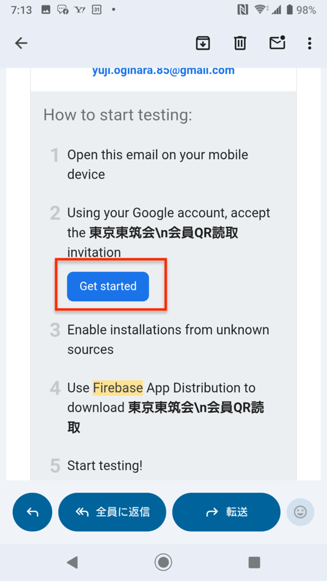
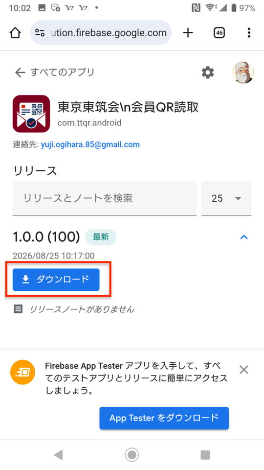
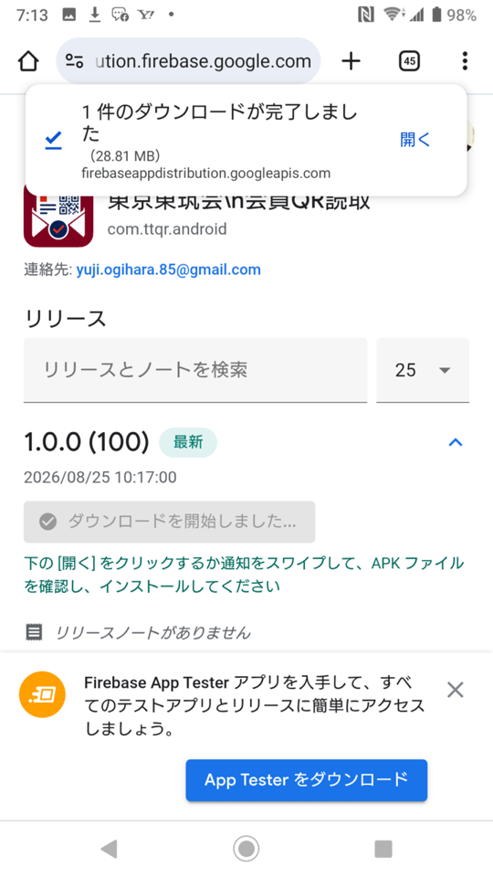
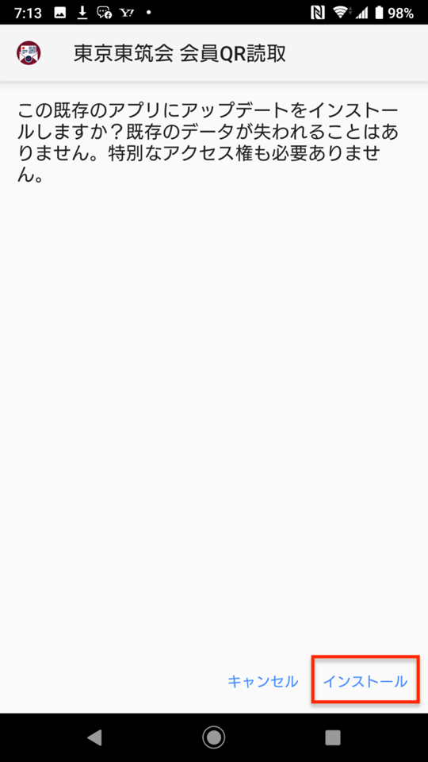
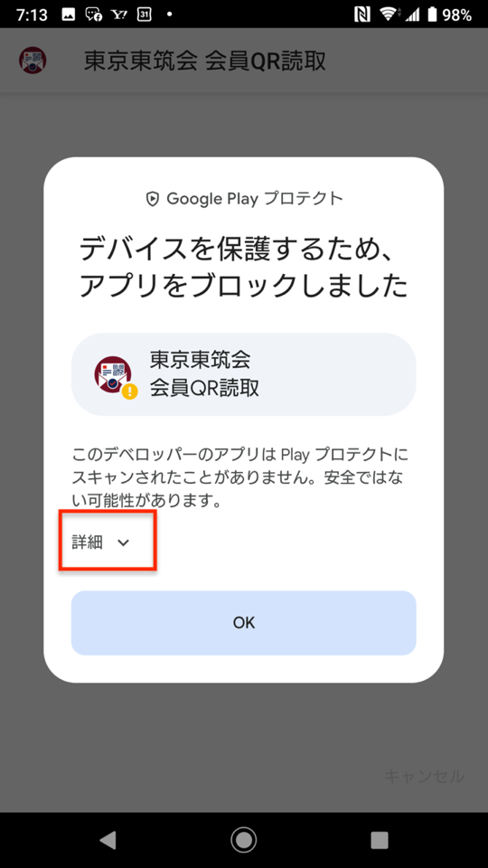
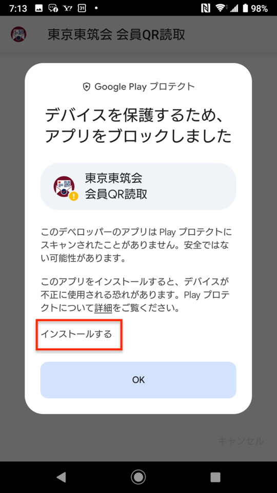
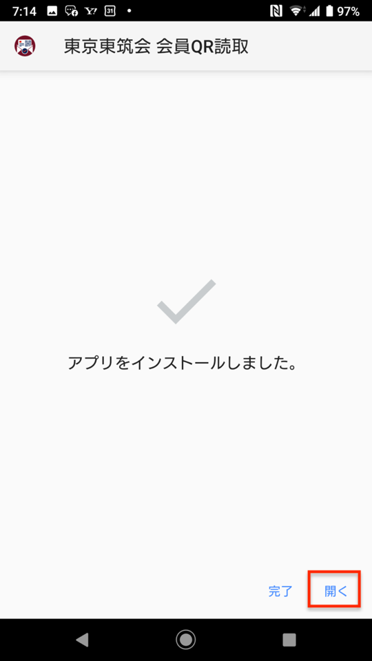

# 東京東筑会 会員QR読取 インストール手順

このアプリは Firebase App Distribution を通じて配布しています。招待メールを受信した Android 端末で、以下の手順に沿ってインストールしてください。

## 事前準備

- 招待を承諾する際は、Google アカウントでログインしてください。
- 招待メールは、アプリをインストールする Android 端末で開いてください。
- 画面の表示や文言は、Android の機種・バージョンによって一部異なる場合があります。

## インストール手順

### 1. 招待を開始する

招待メールを開き、**Get started** をタップします。

### 2. APK をダウンロードする

アプリの配布ページが開いたら、**ダウンロード** をタップします。

### 3. ダウンロードした APK を開く

ダウンロードが完了したら、通知の **開く** をタップします。通知を閉じてしまった場合は、端末の「ダウンロード」から APK ファイルを開いてください。

### 4. アプリをインストールする

確認画面で **インストール** をタップします。すでにアプリが入っている場合は、更新としてインストールされ、既存データは失われません。

### 5. Google Play Protect の確認に対応する

「デバイスを保護するため、アプリをブロックしました」と表示される場合があります。この場合は **詳細** をタップします。

続けて **インストールする** をタップし、表示される確認画面で **OK** をタップします。

### 6. アプリを開く

「アプリをインストールしました。」と表示されたら、**開く** をタップして完了です。

## インストールできない場合

Google アカウントでログインしているか、招待を承諾したアカウントでログインしているかを確認してください。それでも解決しない場合は、担当者へ画面のスクリーンショットを添えて連絡してください。
