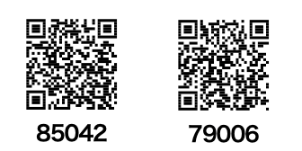

# 東京東筑会 会員QR読取 使い方

宛名ラベルの QR コードを読み取り、宛先不明で返送された封入物を記録するためのアプリです。

## はじめに

アプリは Android 端末で使用します。QR コードを読み取るため、端末のカメラを使用します。

## インストール

アプリは Firebase App Distribution で配布しています。招待メールを受け取った端末で、[インストール手順](install.md) に沿ってインストールしてください。

## 基本操作

### 1. カメラを許可する

初回起動時にカメラの使用許可を求められたら、許可してください。許可しない場合、QR コードを読み取れません。

### 2. 宛名ラベルの QR コードを読み取る

画面上部の「スキャン」タブを開き、宛名ラベルの QR コードをカメラに映します。読み取りに成功すると、会員 ID と氏名が一覧へ追加されます。

同じ QR コードを複数回読み取っても、一覧には重複して追加されません。

読み取り用 QR コードの例です。

### 3. 読み取り結果を送信する

一覧の内容を確認し、画面下部の送信ボタンをタップします。読み取った会員 ID が未達者管理に登録され、連携先へ送信されます。

送信に失敗した場合は、通信状況を確認してから再度お試しください。

### 4. 一覧を確認する

画面上部の「リスト」タブでは、登録済みの ID を確認できます。画面を下へ引っ張ると最新の内容に更新されます。

### 5. ウェブ上での一覧の確認

Google Driveのスプレッドシート上に一覧が記載されます。そのURLは別途連絡します。

## 困ったとき

- QR コードを読み取れない場合は、カメラの使用が許可されているか、QR コード全体が明るく映っているかを確認してください。
- アプリをインストールできない場合は、[インストール手順](install.md) の「インストールできない場合」を確認してください。
- 解決しない場合は、画面のスクリーンショットを添えて担当者へ連絡してください。
